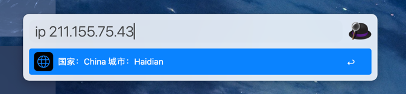

# alfredworkflow
> the workflow for alfred

## Install
___

Download and open workflow file with [Alfred](https://www.alfredapp.com)

btw, you should buy the Powerpack to use the workflow

## Workflows
___

### [IP](https://github.com/Jerrymkjuju/alfredworkflow/IP) 

Query the region corresponding to the IP address with [ip-api.com](https://ip-api.com)

**You should install python2 first**

> doesn't support python3 https://pypi.org/project/Alfred-Workflow/

#### How to use

input **_ip_** with a blank and then input the ip that you want to query

